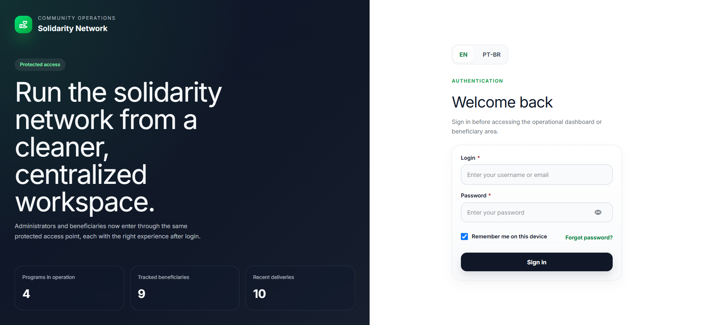
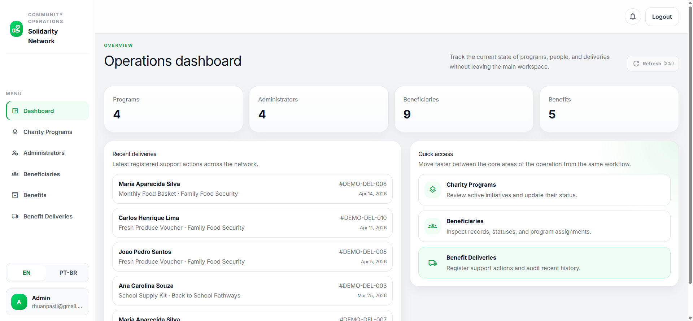
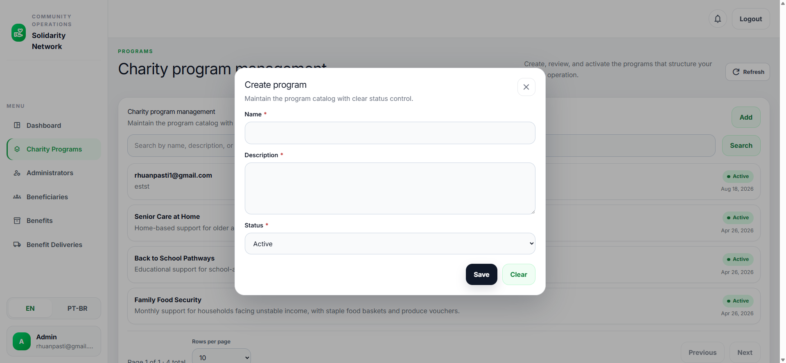

# Solidarity Network

[](https://github.com/rhuanpasti/solidarity-network/actions/workflows/firebase-hosting.yml)
[](LICENSE)

**Angular 21 · NestJS 11 · PostgreSQL · Prisma · Docker**

Solidarity Network is a full-stack, role-based management platform for organizations that coordinate charity programs, beneficiaries, benefits, and deliveries.

[Live demo](https://solidarity-network-live.web.app) · [API documentation](http://localhost:3000/docs) · [Observability guide](docs/observability.md)

> **Demo availability:** The hosted frontend and backend run on the free tiers of their respective providers. The API or database may occasionally be unavailable, sleep between requests, or respond slowly due to free-tier limits and cold starts. The recommended way to run and evaluate the project is locally. This repository is designed to be forked, adapted, and used as a template for other projects.

## Screenshots

### Login



### Operations dashboard



### Charity program management



## Portfolio snapshot

- Multi-scope authorization with separate route, record, and program-assignment policies.
- Secure HTTP-only cookie sessions, CSRF protection, password hashing, rate limiting, and normalized API errors.
- Angular standalone components, Signals, typed forms, lazy routes, runtime English/Portuguese i18n, and cached list state.
- NestJS modules with Prisma repositories, PostgreSQL persistence, audit/version history, Docker development, and API test coverage.

It provides a practical operational workspace that can be forked and adapted to a nonprofit, community initiative, or other social-impact program. The domain model, workflows, visual identity, integrations, deployment model, and policies are intentionally customizable.

In Portuguese, the interface uses the institutional name **Rede Solidaria**.

## Project status and production guidance

This repository is a working application and a reusable foundation, not a turnkey compliance solution. Review the authorization rules, privacy requirements, retention policies, infrastructure, and operational processes before using it with real personal data.

The application includes username/email authentication, password hashing, HTTP-only cookie sessions with CSRF protection, one-time password recovery tokens stored only as hashes, session-version revocation, rate limiting, and role-based authorization. For a production deployment, consider replacing or integrating the built-in authentication with a dedicated identity provider that supports MFA and enterprise recovery controls.

## What it includes

- An administrator workspace for programs, administrators, beneficiaries, benefits, and deliveries.
- A beneficiary portal for linked programs, household dependents, upcoming deliveries, and delivery history.
- Role-aware access for super administrators, program managers, and case workers.
- Runtime English and Portuguese translations.
- Postal-code address lookup for Brazilian beneficiary addresses.
- Temporary access credentials, first-access password changes, password reset emails, and delivery notifications through optional Brevo integration.
- Audit trails, entity version snapshots, request IDs, structured logging, and normalized API errors.
- OpenAPI/Swagger documentation during non-production backend runs.

The beneficiary email is optional. When it is not available, the account can still be created for local credential handoff, but password recovery and email notifications are unavailable for that beneficiary.

## Accounts, roles, and authorization

The system has two account types: `administrator` and `beneficiary`. Administrator accounts have one of three roles. The frontend displays administrator accounts with the generic `Admin` label, but the permission role remains unchanged in the database and API.

| Account or role | Access scope | Allowed | Blocked |
| --- | --- | --- | --- |
| `super_admin` | Global | Full administrator workspace access; create and manage charity programs, administrators, beneficiaries, benefits, and deliveries; assign programs and roles; view all records | The protected root administrator account cannot be modified or removed through the administrator workflow |
| `program_manager` | Assigned charity programs only | View and update assigned programs; manage beneficiaries and deliveries within the assigned program scope; manage the shared benefit catalog; view administrators visible within that scope | Creating programs, creating or editing administrators, resending administrator access, changing roles, and accessing other programs |
| `case_worker` | No operational route access currently granted | Authenticate, maintain the account session, and complete a required password change | Administrator workspace, program management, beneficiary records, benefits, deliveries, and the beneficiary portal |
| `beneficiary` | Own beneficiary account | Read-only beneficiary portal with linked programs, dependents, upcoming deliveries, and delivery history; password and session management | Administrator workspace and all administrator CRUD or delivery-management endpoints |
| Unauthenticated visitor | Public endpoints only | Login, password recovery/reset, and public login metrics | All protected application and API resources |

Authorization is enforced in the backend API; hidden frontend navigation is only a usability feature and is not the security boundary. Requests from an authenticated account with the wrong account type or role receive `403 Forbidden`, while requests without valid authentication receive `401 Unauthorized`.

Additional access rules:

- Non-super administrators are restricted to records associated with their assigned charity programs.
- A beneficiary can access only their own portal summary; the portal does not expose administrator CRUD operations.
- Accounts created with a temporary password must complete the first-access password change before accessing protected operational resources.
- The system root administrator is immutable through the administrator management workflow.

## Technology

- `Angular 21` with standalone components, Signals, typed reactive forms, lazy routes, and runtime i18n.
- `NestJS 11` with controllers, services, repositories, DTO validation, authorization guards, and global error handling.
- `Prisma 6` with `PostgreSQL 16`.
- `TypeScript 5.9` across the stack.
- `Docker Compose` for local PostgreSQL and containerized application runs.
- `npm workspaces` for the monorepo.

## Repository structure

```text
solidarity-network/
|- apps/
|  |- backend/       NestJS API and Prisma schema
|  \- frontend/      Angular application
|- packages/
|  \- shared/        Shared enums, contracts, and view models
|- docs/
|  \- observability.md
|- docker-compose.yml
\- README.md
```

## Architecture

At runtime, the main request path is:

```text
Angular UI -> NestJS REST API -> Authorization + domain services -> Prisma -> PostgreSQL
                                      |                    |
                                      v                    v
                              Structured logs       Audit/version history
```

### Backend

- `src/common`: global filters, interceptors, DTO helpers, and validation.
- `src/config`: environment parsing and validation.
- `src/prisma`: Prisma client module.
- `src/modules/auth`: authentication, sessions, password changes, and recovery.
- `src/modules/authorization`: account and role policies.
- `src/modules/observability`: request tracing, structured logs, audit trails, and entity versions.
- `src/modules/*`: domain modules organized around controllers, services, and repositories.

### Frontend

- `src/app/core`: application shell, auth, HTTP configuration, layout, i18n, and interceptors.
- `src/app/shared`: reusable UI components, utilities, and types.
- `src/app/features`: lazy-loaded pages for each operational area.
- Standalone components, Signals for local state, and typed reactive forms.

New UI work should use the repository's shared components and Tailwind utilities where available. Keep component-specific styling limited to cases that shared utilities cannot express.

### Shared package

The shared package contains domain enums, API contracts, pagination types, filters, and view models consumed by both applications.

## Main features

### Charity programs

- Create, update, list, view, activate, and deactivate programs.
- Link administrators and beneficiaries through many-to-many relationships.

### Administrators

- Create, update, list, and view administrators.
- Assign roles and program access.
- Resend temporary access credentials.

### Beneficiaries

- Create, update, list, and view beneficiary records.
- Filter by program, status, and name.
- Store optional email, address, notes, and dependents.
- Look up Brazilian addresses by postal code.

### Benefits and deliveries

- Create, update, list, view, activate, and deactivate benefits.
- Register deliveries with beneficiary, program, benefit, quantity, date, notes, and a unique reference.
- Review delivery history and filter by beneficiary or program.

### Beneficiary portal

Beneficiaries can sign in through the same protected entry point and view their linked programs, dependents, upcoming deliveries, and past deliveries.

## Data model

Core entities:

- `CharityProgram`
- `Administrator`
- `AuthCredential`
- `Beneficiary`
- `BeneficiaryDependent`
- `Benefit`
- `BenefitDelivery`

Supporting entities:

- `AdministratorProgramLink`
- `BeneficiaryProgramLink`
- `AuditTrail`
- `EntityVersion`
- `PasswordResetToken` (hash-only, expiring, single-use recovery records)

Addresses are stored as structured JSON on beneficiary records. Statuses, roles, dependent relationships, and benefit categories use typed enums.

## API summary

The API uses the `/api/v1` global prefix. In development, interactive Swagger documentation is available at `http://localhost:3000/docs`.

### Authentication

- `POST /api/v1/auth/login`
- `GET /api/v1/auth/session`
- `POST /api/v1/auth/logout`
- `POST /api/v1/auth/forgot-password`
- `POST /api/v1/auth/reset-password`
- `POST /api/v1/auth/change-password`

Sessions are issued as an HTTP-only cookie. The API also accepts a bearer token for documented API clients. Each JWT
contains the account `sessionVersion`; changing or resetting a password increments that value and invalidates older
sessions. Password recovery always returns a generic response, rate-limits by resolved IP and identifier, invalidates
older recovery records, stores only a token hash, and consumes the token once before changing the password.

### Public

- `GET /api/v1/public/login-metrics`

### Charity programs

- `GET|POST /api/v1/charity-programs`
- `GET|PATCH /api/v1/charity-programs/:id`
- `PATCH /api/v1/charity-programs/:id/status`

### Administrators

- `GET|POST /api/v1/administrators`
- `GET|PATCH /api/v1/administrators/:id`
- `POST /api/v1/administrators/:id/resend-access`

### Beneficiaries

- `GET|POST /api/v1/beneficiaries`
- `GET|PATCH /api/v1/beneficiaries/:id`
- `GET /api/v1/beneficiaries/address-lookup`

### Beneficiary portal

- `GET /api/v1/beneficiary-portal/me`

### Benefits

- `GET|POST /api/v1/benefits`
- `GET|PATCH /api/v1/benefits/:id`
- `PATCH /api/v1/benefits/:id/status`

### Benefit deliveries

- `GET|POST /api/v1/benefit-deliveries`
- `GET /api/v1/benefit-deliveries/:id`

## Local development

### Prerequisites

- Node.js 24 or a compatible current Node.js release.
- npm.
- Docker Desktop or another Docker Engine with Compose support.

### 1. Install dependencies and configure the database

From the repository root:

```bash
npm install --workspaces
```

Create a root `.env` from `.env.example`, replace `POSTGRES_PASSWORD` and `JWT_SECRET` with strong values, and start PostgreSQL:

```bash
docker compose up -d postgres
```

Then create `apps/backend/.env` from `apps/backend/.env.example` and set its `DATABASE_URL` to match the local PostgreSQL credentials. The backend environment must contain a `JWT_SECRET` with at least 32 characters.

### 2. Prepare and seed the backend

```bash
npm --prefix apps/backend run prisma:generate
npm --prefix apps/backend run prisma:migrate
npm run seed:backend
```

The seed is synthetic/demo-only and transactional. It is disabled unless `DEMO_SEED_ENABLED=true` and refuses to run in
production. It creates an administrator login only when both `SEED_ADMIN_USERNAME` and `SEED_ADMIN_PASSWORD` are set;
there is no default password. Never point it at a real-data database.

For macOS/Linux, the helper script can prepare the database before starting the API:

```bash
./scripts/dev-backend.sh --prepare-db
```

### 3. Start the applications

From the repository root, in separate terminals:

```bash
npm run start:backend
npm run start:frontend
```

- Frontend: `http://localhost:4200`
- Backend API: `http://localhost:3000/api/v1`
- Swagger UI: `http://localhost:3000/docs` (development only)

The frontend's local API URL is configured in `apps/frontend/src/environments/environment.ts`.

### Demo mode

Demo mode is enabled with `DEMO_MODE=true` in the backend environment and `demoMode: true` in the matching frontend environment. Configure `DEMO_USER_USERNAME`, `DEMO_USER_EMAIL`, and `DEMO_USER_PASSWORD` with the same values used by `demoCredentials`. The default login is `demo-user` with password `demo-user-2026`. The demo account is a synthetic super admin: its token never queries real records, demo changes are returned as previews without database persistence, email delivery is disabled, and all CPFs and cellphone numbers shown in synthetic data are deliberately invalid.

### Docker Compose full stack

After configuring the root `.env`, start PostgreSQL, the backend, and the frontend together with:

```bash
docker compose up --build
```

The Compose backend applies migrations on startup. It does not run the seed automatically.

The backend runs on Render using the repository's Dockerfile and the environment variables configured in the Render
dashboard. Prisma migrations are applied through `start:prod`. The frontend can be deployed to Firebase Hosting or
Cloudflare Workers; PostgreSQL is the backend's only required external service.

## Useful commands

```bash
npm run build
npm run lint
npm test
npm run build:shared
npx prisma validate --schema apps/backend/prisma/schema.prisma
```

Coverage is intentionally available through the existing test runners; use the backend/frontend test commands with
their project-specific coverage flags when a report is needed. Automated deployment is handled by the Firebase Hosting
workflow; validation remains available for local development.

### Playwright E2E

The browser tests live in the separate `tests/e2e` workspace and support both the local application and the published
deployment. Copy `tests/e2e/.env.example` to `tests/e2e/.env`, choose `E2E_TARGET=local` or `E2E_TARGET=published`, and
set the target-specific URLs and login credentials. Never commit this file.

```bash
npm run test:e2e:install
npm run test:e2e
npm run test:e2e:ui
npm run test:e2e:headed
```

Local E2E tests expect the frontend and backend to already be running. Published tests use the configured public URLs;
the Playwright config does not start or deploy services. The form-preview spec uses synthetic values only to exercise
the UI and intentionally does not submit beneficiary registrations, because the current CPF rules make repeated real
registrations unsuitable for an automated suite.

Frontend deployment commands are available for Firebase Hosting and Cloudflare Workers:

```bash
npm --prefix apps/frontend run deploy:firebase
npm run deploy:frontend:workers
```

## Transactional email

Brevo email delivery is disabled by default for development and tests. To enable password recovery, temporary-password messages, and delivery notifications, configure:

- `BREVO_ENABLED=true`
- `BREVO_API_KEY=<brevo-api-key>`
- `BREVO_FROM_EMAIL=<verified-sender-email>`
- `BREVO_FROM_NAME=<sender-name>`
- `APP_PUBLIC_URL=<frontend-origin>`

Optional: `PASSWORD_RESET_PATH=/reset-password`.

Never commit Brevo credentials. Treat credentials shared in chat, tickets, or logs as compromised and rotate them before production use. The sender address must be verified in Brevo; domain authentication is recommended for deliverability.

## Internationalization

Runtime translations are stored in:

- `apps/frontend/public/assets/i18n/en.json`
- `apps/frontend/public/assets/i18n/pt-br.json`

English is the default locale. Portuguese uses the institutional label `Rede Solidaria`.

## Observability

The backend adds request IDs, structured request logs, audit events, and entity-version snapshots. See [docs/observability.md](docs/observability.md) for event fields, error behavior, and operational guidance.

## Deployment and security checklist

- Do not commit secrets or use placeholder credentials in production.
- Set a unique `JWT_SECRET` with at least 32 characters.
- Restrict `CORS_ORIGIN` to the deployed frontend origins.
- Set `TRUST_PROXY` to the exact reverse-proxy topology (`false` locally/Docker, `1` for a single Render proxy hop); do not trust arbitrary forwarded headers.
- Keep Swagger disabled in production; it is disabled automatically when `NODE_ENV=production`.
- Configure `APP_PUBLIC_URL` and Brevo sender settings when email is enabled.
- Provision bootstrap administrator credentials explicitly through `SEED_ADMIN_USERNAME` and `SEED_ADMIN_PASSWORD`, then rotate or replace them according to your operational policy.
- Review the authorization and privacy model before exposing real beneficiary data.
- Replace the process-local auth rate limiter with a shared limiter such as Redis when running multiple API instances.
- Define retention/anonymization rules for beneficiary audit and entity-version snapshots before using real personal data; persisted snapshots mask documents, phones, addresses, and email locals but remain personal data.
- Use the maintained `@nestjs/jwt` integration for token signing and verification, and evaluate a dedicated identity provider for MFA, recovery, and enterprise account controls.

## License

This project is distributed under the license in [LICENSE](LICENSE).
